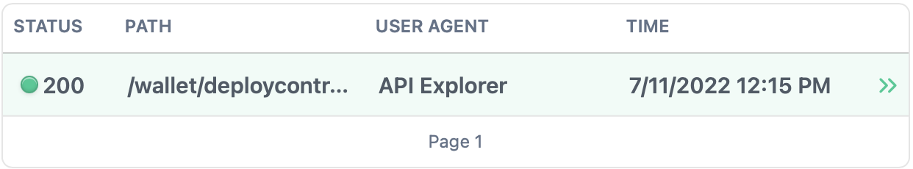

## Tron Security Dashcam | Tron Grand Hackathon 2022
The Tron Security Dashcam is a novel collection of dashboards that display result monitors fishy activity that happens on-chain, &amp; also notifies Tron Security experts about what's happening in Web3.

<!-- image -->
<p align="center">
  
</p>

<b> Abstract </b> </br>
Security in Web3 has been an uphill battle to jumpstart mass adoption. Most blockchain experts would agree that the risky nature of blockchain projects is obscuring the road to mass adoption. A lot of individuals already fear the high volatility of crypto assets, but with an added layer of hacks, scams, exploits, and de-adversarial attacks that result in rekts and rugs, we are long ways from a risk-averse journey to mass adoption. The Tron protcol's biggest vulnerabilty is high traffic volume caused by Super Representatives; with TSD we are able to monitor SR activity amid other vulnerabilities that could result in an attack.

<b> Hack History </b> </br>
On May 6th, 2019, the Tron Foundation reported a vulnerability that could have rendered the Tron blockchain useless 😲. With a single machine, an attacker could have deployed a DDos Attack (distributed denial of service attack) to 51%-100% of the Super Representative (SR) node. The SR is a block producer on the Tron Network similar to that of a validator or baker. If deployed, it would approximately take 1000-10000 requests to overload the Tron blockchain and crash the network making it inoperable. We want to prevent catastrophes like this from happening, not just apply reactive solutions like we see propagate much more in the current Web3 risk landscape. 

A hacker would have to deploy a request to ```/wallet/deploycontract``` to write to the contract and then overload the traffic on the Tron blockchain.
<!-- image -->
<p align="center">
  
</p>

See full contract deployment code here :star: :
```
curl --request POST \
2     --url https://api.shasta.trongrid.io/wallet/deploycontract \
3     --header 'Accept: application/json' \
4     --header 'Content-Type: application/json' \
5     --data '
6{
7     "abi": "[{\"constant\":false,\"inputs\":[{\"name\":\"key\",\"type\":\"uint256\"},{\"name\":\"value\",\"type\":\"uint256\"}],\"name\":\"set\",\"outputs\":[],\"payable\":false,\"stateMutability\":\"nonpayable\",\"type\":\"function\"},{\"constant\":true,\"inputs\":[{\"name\":\"key\",\"type\":\"uint256\"}],\"name\":\"get\",\"outputs\":[{\"name\":\"value\",\"type\":\"uint256\"}],\"payable\":false,\"stateMutability\":\"view\",\"type\":\"function\"}]",
8     "bytecode": "608060405234801561001057600080fd5b5060de8061001f6000396000f30060806040526004361060485763ffffffff7c01000000000000000000000000000000000000000000000000000000006000350416631ab06ee58114604d5780639507d39a146067575b600080fd5b348015605857600080fd5b506065600435602435608e565b005b348015607257600080fd5b50607c60043560a0565b60408051918252519081900360200190f35b60009182526020829052604090912055565b600090815260208190526040902054905600a165627a7a72305820fdfe832221d60dd582b4526afa20518b98c2e1cb0054653053a844cf265b25040029",
9     "owner_address": "41D1E7A6BC354106CB410E65FF8B181C600FF14292",
10     "name": "SomeContract"
11}
12'
```

<b> Introducing TSD </b> </br>
The Tron Security Dashcam serves as a product just about every blockchain will need to surveill its blockchain, including any off-chain vulnerabilities such as Discords, Twitters, servers, etc., that could act as potential points of failure for the blockchain and it's tokens. Decentralized Finance is the most risky sub-sector of crypto being that smart contracts are the main exploitable attack vector sought after by hackers. Similar to how a dashcam in an individual's car records accidents that occur while the driver is present and absent, the TSD serves as a surveillance mechanism to track each PR, smart contract alteration, and just about any permutation on-chain that would threaten the health of the Tron blockchain.

<b> Future of Work </b> 

