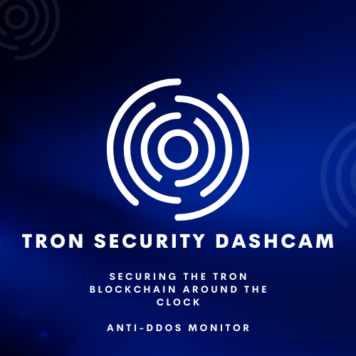

# Tron Security Dashcam | Tron Grand Hackathon 2022
The Tron Security Dashkit is a start-of-the-art risk collection of dashboards that monitors fishy activity that happens on-chain, &amp; also notifies Tron Security experts about what's happening in Web3.

<!-- image -->
<p align="center">
  
</p>

<b> Abstract </b> </br>
Security in Web3 has been an uphill battle to Mass Adoption. Most blockchain experts would agree that the risky nature of blockchain projects is obscuring the road to mass adoption. A lot of individuals already fear the high volatility of crypto assets, but with an added layer of hacks, scams, exploits, and de-adversarial attacks that result in rekts and rugs, we are long ways from a risk-adverse on slot of mass adoption.

<b> Hack History </b> </br>
On May 6th, 2019, the Tron Foundation reported to have a vulnerablity that could have rendered the Tron blockchain useless :surprised: . With a single machine, an attacker could have deployed a DDos Attack (distributed denial of service attack) to 51%-100% of the Super Representative (SR) node. The SR is a block producer on the Tron Network similar to that of a validator. If deployed, it would approximately take 1000-10000 requests to overload the Tron blockchain and crash the network making it inoperable. We want to prevent catastrophes like this from happening not just apply reactive solutions like we see propagate much more in the current Web3 risk landscape. 

A hacker would have to do is deploy a request to ```/wallet/deploycontract``` to write to the contract and then overload the traffic on the Tron blockchain.

<b> Introducing TSD </b> </br>
The Tron Security Dashcam serves as a product just about every blockchain will need to surveill its blockchain, including any off-chain vulnerabilities such as Discords, Twitters, servers, etc., that could act as potential points of failure for the blockchain and it's tokens. Decentralized Finance is the most risky sub-sector of crypto being that smart contracts are the main exploitable attack vector sought after by hackers. 
