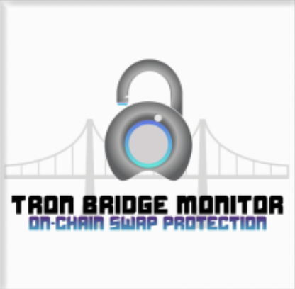

## Tron Bridge Monitor
---
## Inspiration
In Tron Grand Hackathon Season 2 the Rektify AI team submitted the Tron Security Dashcam, a novel collection of dashboards that display result monitors fishy activity that happens on-chain, & also notifies Tron Security experts about what's happening in Web3. As promised in the future work section of the product we focused extensively on optimizing the Tron bridge monitoring system. 

<!-- image -->

  

Bridges have been the source of more than 75% of the funds lost in hacks this year in cryptocurrency. The need for a threat identification system with a continuous nature is needed so that cross-chain bridge architecture to scale. Since the Tron Blockchain interacts with several networks for cross-chain transactions our focus for this system has been TronPad.

## What it does
Tracks the number of Tron validators, gives categorical feedback on assets being primed for bridge wrapper, tracks merkle tree validation, and monitors hash rates. Bridge exploits tend to be due to mismanagement of API keys, pseudo-auth, and more importantly contract vulnerabilities. 

## How we built it
React JS, Python, Infura, Bitquery API, and Solidity.

## Challenges we ran into
We couldn't find the contract hash for TronPad via [debridges](https://debridges.com/tron-bridges) which was a huge roadblock in collecting real-time data on the cross-bridge contract.

## Accomplishments that we're proud of
We're proud to have come back for Season 3 with a fresh outlook of what we could add to the bridge architecture to make it useful for Tron and other Layer-1 chains.

## What we learned
Threat responses from the network/blockchain are the only reactive response that can intervene in the event of an attack, such as platform halts (e.g. BNB Bridge exploit on Oct. 6, 2022 resulting in $570M lost). Meaning that Web3 security platforms can offer support through threat mitigation, auditing, and monitoring systems.

## What's next for Tron Bridge Monitor System
We would like to work directly with the Tron network for research and auditing of the cross-chain bridge architecture. Cross-chain bridge technology is experimental, the attack surface is vast giving hackers more opportunities to exploit attack vectors, and the cashflow in these bridge contracts are expansive.
